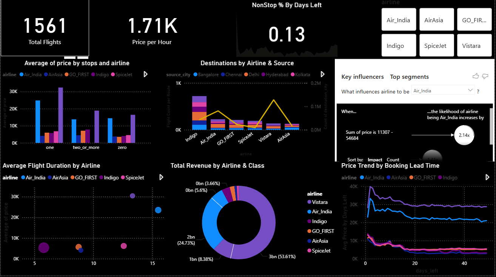

# Airlines-Dataset

This repository contains a dataset of domestic airline flights in India, including **flight details, schedules, travel classes, and ticket prices**. It is suitable for projects involving **exploratory data analysis (EDA), flight price prediction, or travel trend analysis**.

## Dataset Description

| Column Name        | Description                                                                 |
|-------------------|-----------------------------------------------------------------------------|
| `index`           | Unique identifier for each flight record                                     |
| `airline`         | Name of the airline (e.g., SpiceJet, AirAsia)                               |
| `flight`          | Flight number/identifier                                                    |
| `source_city`     | City of departure                                                           |
| `departure_time`  | Scheduled departure time period (e.g., Early_Morning, Evening)             |
| `stops`           | Number of stops on the flight (e.g., zero = direct flight)                 |
| `arrival_time`    | Scheduled arrival time period (e.g., Morning, Night)                       |
| `destination_city`| Arrival city                                                               |
| `class`           | Travel class (e.g., Economy, Business)                                     |
| `duration`        | Flight duration in hours (decimal format)                                   |
| `days_left`       | Number of days left until departure                                         |
| `price`           | Ticket price in Indian Rupees                                               |

## Usage

This dataset can be used for:  
- Exploratory Data Analysis (EDA)  
- Flight price prediction models  
- Analyzing travel patterns and trends

  

## File Format

- The dataset is available in `.xlsx` format (or `.pbix` if using Power BI).  
- Ensure that your environment can read the file type you choose to work with.
